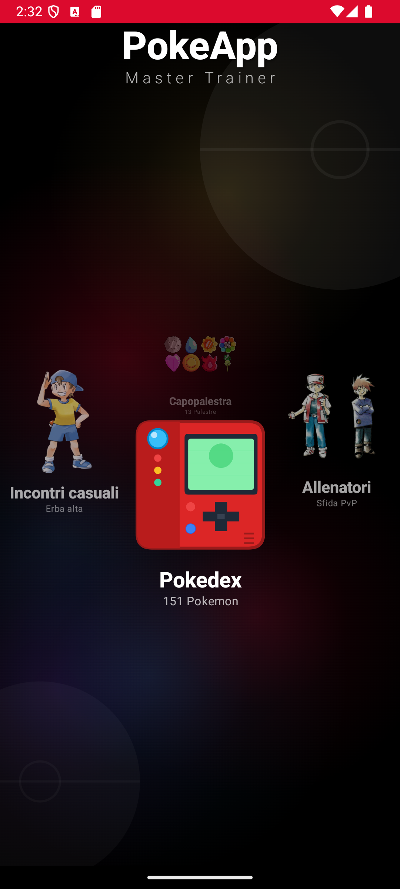
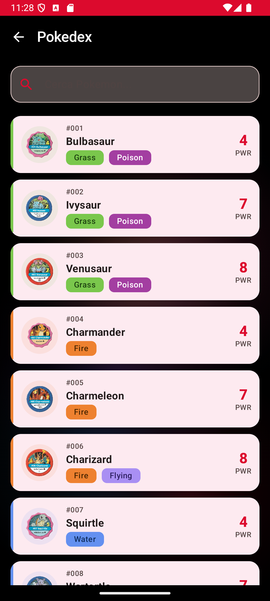
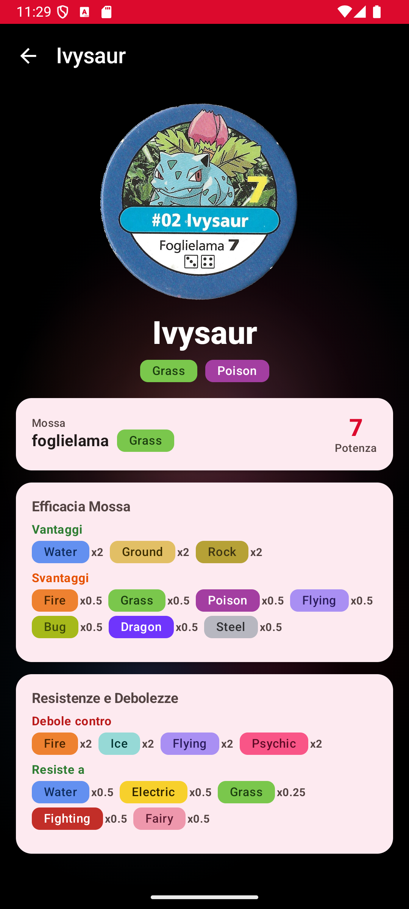
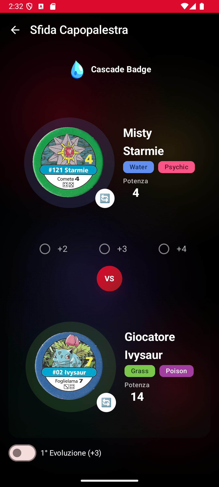
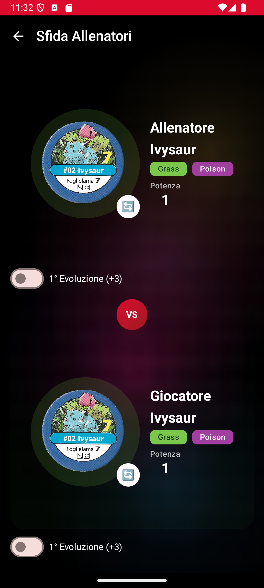

<h1 align="center">PokeApp - Master Trainer</h1>

<p align="center">
  <a href="https://github.com/masymasy94/NewPokeApp/actions/workflows/build.yml"></a>
  
  
  
  
</p>

<p align="center">
  Android companion app for the <b>Pokemon Master Trainer</b> board game.<br/>
  Look up Pokemon stats, calculate type effectiveness, and manage battles during gameplay.
</p>

## Screenshots

<p align="center">
  
  
  
  
  
</p>

## Features

- **151 Pokemon** - Complete Gen 1 Pokedex with original artwork, stats, types, and Italian names
- **Trainer Battles** - Player vs Player combat with power calculation, type advantages, and evolution toggles
- **Gym Leaders** - Challenge 13 gym leaders, each with their fixed signature Pokemon, badge image, and dice bonus system
- **Random Encounters** - Simulate wild Pokemon encounters from the board game with evolution support
- **Type Effectiveness** - Full type chart with damage multipliers, strengths, and weaknesses
- **Evolution System** - Toggle evolution stages with power bonuses (+3 / +2) on player Pokemon
- **Dark Theme** - Pokemon-style dark UI with vibrant type-colored accents and custom artwork

## Tech Stack

- **Kotlin** - 100% Kotlin codebase
- **Jetpack Compose** - Declarative UI with Material 3
- **Hilt** - Dependency injection
- **Room** - Local database for Pokemon, gym leaders, and encounters
- **Coroutines + Flow** - Reactive async data streams
- **Navigation Compose** - Single-activity navigation
- **KSP** - Kotlin Symbol Processing for annotation processing
- **Gradle KTS** - Type-safe build configuration

## Architecture

The app follows **MVVM + Repository** pattern with a clean separation of layers:

```
app/
├── data/
│   ├── local/          # Room database, DAOs, entities
│   ├── mapper/         # Entity <-> Domain mappers
│   └── repository/     # Repository implementations (with caching)
├── di/                 # Hilt modules
├── domain/
│   ├── model/          # Domain models, battle calculator, type system
│   └── repository/     # Repository interfaces
└── presentation/
    ├── components/     # Reusable Compose components (BattleArena, TypeBadge, etc.)
    ├── navigation/     # Navigation graph and screen routes
    ├── screen/         # Screens + ViewModels (one per feature)
    └── theme/          # Colors, typography, shapes, dimensions
```

> [!NOTE]
> Data is loaded once from Room and cached in-memory via Repository + StateFlow, so subsequent screen navigations and picker openings are instant.

## Download

Download the latest debug APK from [GitHub Actions](https://github.com/masymasy94/NewPokeApp/actions) (click the latest successful build, then download the `app-debug` artifact).

## Getting Started

### Prerequisites

- Android Studio Hedgehog (2023.1) or newer
- JDK 17
- Android SDK 34

### Setup

```bash
git clone https://github.com/masymasy94/NewPokeApp.git
cd NewPokeApp
./gradlew assembleDebug
```

Then open in Android Studio and run on an emulator or physical device.

## License

```
MIT License

Copyright (c) 2024 masymasy94
```
